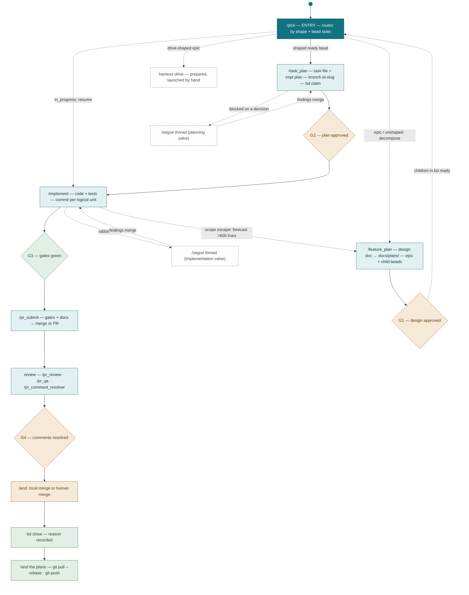
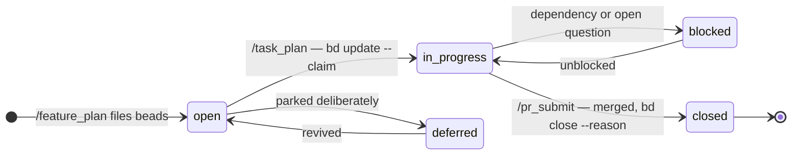
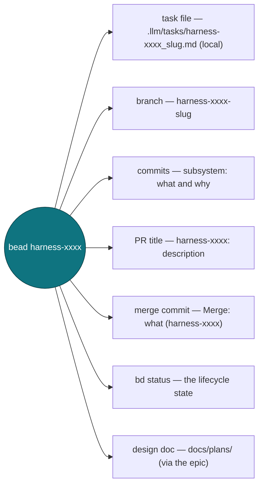

# Dev Workflow — Spec & Diagrams

Command-driven lifecycle for developing **this repo** with Claude Code. It is dev tooling for the harness, not a harness feature — nothing here ships in `src/harness/`. State lives in bd; the commands are markdown in `.claude/commands/`.

Diagrams are mermaid — they render on GitHub and in VS Code.

## The chain

```
/pick (entry, routes by state) ⇢ /feature_plan → /task_plan → /implement → /pr_submit → land → bd close
```

Every command ends by naming the next one, so the workflow self-navigates. `/pick` is the entry door, not a chain stage: it surfaces prioritized ready work and routes by bead shape and state.

## 1. Lifecycle master map



Legend: teal = command · filled teal = entry · amber = human gate · green = automated gate / completion · dashed grey = optional side path.

## 2. Bead state machine

bd is the single state home. Commands fire the transitions; there is no board automation — `bd close` is a deliberate step in `/pr_submit`. State lives in bd, never in a session's memory.



`bd ready` = open, unblocked, and not someone else's. `--claim` is atomic (assign + `in_progress`) and is what makes concurrent sessions safe.

## 3. Gates

| # | Gate | Where | Kind | Blocks |
|---|---|---|---|---|
| G1 | Design doc approved | `/feature_plan` | Human | Filing beads — beads are commitment, the doc is a proposal |
| G2 | Implementation plan approved | `/task_plan` | Human | Any code |
| G3 | Local gate suite green | `/pr_submit` | Automated | Push / merge |
| G4 | Review comments resolved | `/pr_submit` + review | Human | Merge |

There is no hosted CI here. G3 is `ruff check` · `ruff format` · `mypy src tests` · `pytest` — and pre-commit runs them on every commit, with pytest gated at push time. That makes G3 the hardest gate in the chain; the human gates are the soft ones.

## 4. The thread ID

The linchpin. One bead id connects every artifact, which is what lets each command rebuild state from scratch — any session, any machine, no handoff notes.



## 5. Command inventory

| Command | Job |
|---|---|
| `/pick` | Entry door: prioritized ready work + epic trees; routes epic/unshaped → `/feature_plan`, shaped ready → `/task_plan`, in_progress → `/implement`, blocked → show blocker, drive-shaped → prepare `harness drive` |
| `/feature_plan` | Explore → design doc (G1) → epic + sized child beads as **direct** children |
| `/task_plan` | Read design doc → task file + plan (G2) → branch → `bd update --claim` |
| `/implement` | Idempotent resume: load the task file, orient, execute, commit per logical unit |
| `/pr_submit` | Gate suite (G3) → docs resolved → push → local merge or PR (+ `bin/pr-stack`) → comments (G4) → `bd close` → land the plane |
| `/pr_review` | Reviewer side: full-context review of a PR or a branch diff |
| `/pr_qa` | Manual QA of what tests can't cover: chat, TUI, tool loop, streaming, driver |
| `/pr_fix_ci` | Gate-failure triage: branch-introduced vs environment vs pre-existing |
| `/pr_comment_resolver` | Fetch, address, and resolve PR review comments |
| `/test_fix` | Group pytest failures by root cause, fix causes not assertions |
| `/run_lint` | ruff + mypy pass with the no-blanket-suppression rule |
| `/update_docs` | Deep doc pass; keeps `CLAUDE.md` honest against the code |
| `/segue` ×5 | Isolated discussion thread with findings-only merge-back (global commands in `~/.claude/commands/`, not vendored here) |

Inclusion principle: a command earns its place only if a lifecycle gate or transition breaks without it.

## 6. Contract slots

Exactly one owner per slot. Ambient tooling (memory systems, indexers, background agents) must not claim authority over any of them.

| Slot | Owner |
|---|---|
| State machine | bd — `open` → `in_progress` → `closed`, plus `blocked` / `deferred` |
| Resumability artifact | Task files in `.llm/tasks/` + design docs in `docs/plans/` — `/implement` reloads them in any fresh session |
| Memory home | `CLAUDE.md` (invariants, commands, conventions) + `AGENTS.md` (bd protocol) + `docs/` |

## 7. Sizing

A bead fits when its acceptance criteria fit in ≤5 testable bullets. More is an epic; decompose.

| Size | Added lines | Guidance |
|---|---|---|
| XS | <100 | Fine as-is; consider batching with related work |
| S | 100–300 | Ideal |
| M | 300–600 | Healthy upper bound |
| L | 600–1,200 | Split if possible |
| XL | 1,200+ | Must split |

**Scope-escape rule:** a mid-implementation forecast past ~600 added lines, or new acceptance criteria appearing → stop, file a child bead, land the current slice clean.

## 8. Repo-specific rules that override generic advice

- **`bd dolt start` must be running** or ~10 daemon/plan tests fail. Looks like a regression; isn't.
- **`uv sync --extra all`**, always. Plain `uv sync` prunes omitted extras and silently breaks mypy, pytest, symbol reads, and the browser smoke gate.
- **Drives are prepared, never launched.** `harness drive` commands get handed to Mark; the loop artifacts get analyzed afterward.
- **Decomposed beads must be direct epic children** (`parent-child:<epic>`), never a dep chain — a chained sub-bead never surfaces in `bd ready` and the driver never sees it.
- **Drive-behavior fixes are FSM-path only** — the default `--no-fsm` bypasses the gate-quality and revive hardening.
- **ab (`airton_b`) beads are internal scratchpad.** `/pick` filters them out; don't route human work to them.
