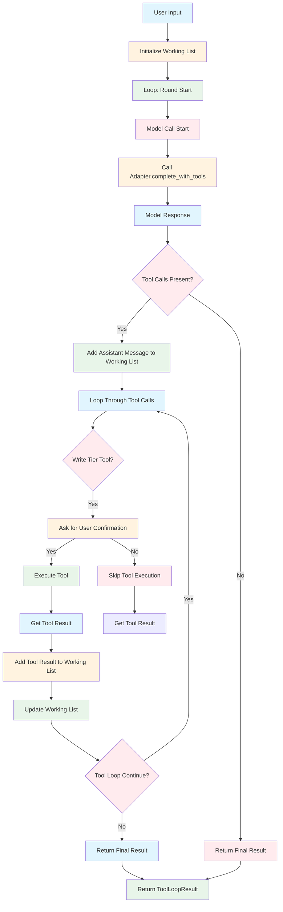

# Tool Loop Data Flow

```mermaid
graph TD
    A[User Input] --> B[Initialize Working List]
    B --> C[Loop: Round Start]
    C --> D[Model Call Start]
    D --> E[Call Adapter.complete_with_tools]
    E --> F[Model Response]
    F --> G{Tool Calls Present?}
    G -->|Yes| H[Add Assistant Message to Working List]
    H --> I[Loop Through Tool Calls]
    I --> J{Write Tier Tool?}
    J -->|Yes| K[Ask for User Confirmation]
    K -->|Yes| L[Execute Tool]
    K -->|No| M[Skip Tool Execution]
    L --> N[Get Tool Result]
    M --> O[Get Tool Result]
    N --> P[Add Tool Result to Working List]
    P --> Q[Update Working List]
    Q --> R{Tool Loop Continue?}
    R -->|Yes| I
    R -->|No| S[Return Final Result]
    G -->|No| T[Return Final Result]
    
    S --> U[Return ToolLoopResult]
    T --> U

    style A fill:#e1f5fe
    style B fill:#fff3e0
    style C fill:#e8f5e9
    style D fill:#ffebee
    style E fill:#fff3e0
    style F fill:#e1f5fe
    style G fill:#ffebee
    style H fill:#e8f5e9
    style I fill:#e1f5fe
    style J fill:#ffebee
    style K fill:#fff3e0
    style L fill:#e8f5e9
    style M fill:#ffebee
    style N fill:#e1f5fe
    style P fill:#fff3e0
    style Q fill:#e8f5e9
    style R fill:#ffebee
    style S fill:#e1f5fe
    style T fill:#ffebee
    style U fill:#e8f5e9
```